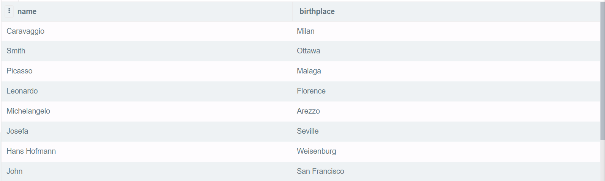
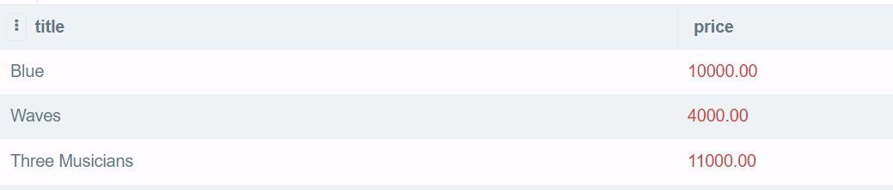
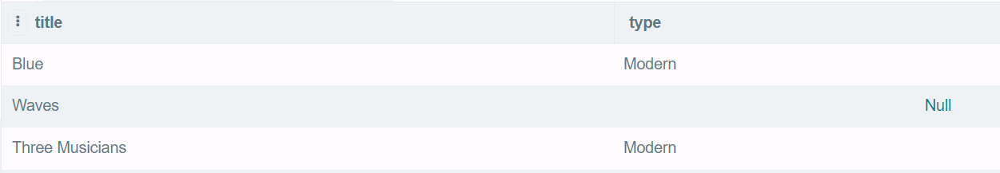
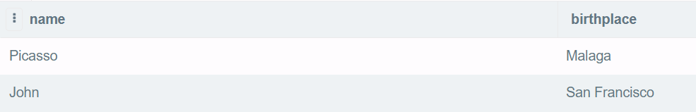
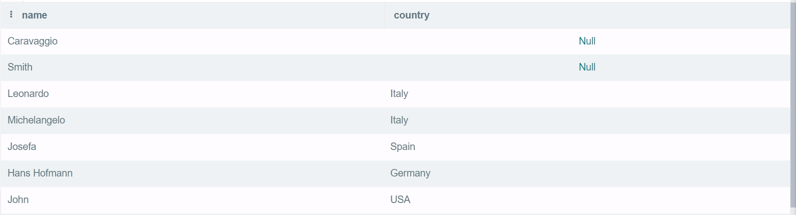
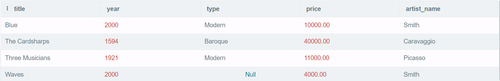
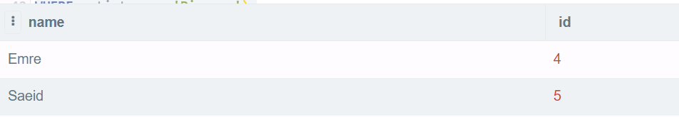
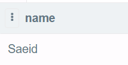

### Réponses aux questions du lab

1. Lister les name et birthplace de tous les artists
```sql
SELECT name,birthplace
FROM artists;
```
Résultat obtenu:



2. Lister le title et le price de toutes les artworks après 1600
```sql
SELECT title,price
FROM artworks
WHERE year > 1600;
```
Résultat obtenu:


3. Lister le title et le type de toutes les artworks qui ont été peintes en 2000 ou peintes par Picasso
```sql
SELECT title,type
FROM artworks
WHERE year=2000 OR artist_name='Picasso';
```
Résultat obtenu:


4. Lister les name et birthplace de tous les artists nés entre 1880 et 1930. (ASTUCE: EXTRACT(YEAR FROM dateofbirth) vous donne l'année à partir d'un attribut DATE)
```sql
SELECT name,birthplace
FROM artists
WHERE EXTRACT(year from dateofbirth) BETWEEN 1880 and 1930;
```
Résultat obtnu:


5. Lister les name et le country de naissance de tous les artists dont le style de peinture est Modern, Baroque or Renaissance. (ASTUCE: utilisez le mot-clé IN)
```sql
SELECT name,country
FROM artists
WHERE style IN('Modern','Baroque','Renaissance');
```
Résultat obtenu:


6. Lister tous les détails des artworks dans la base de données, triés par title
```sql
SELECT *
FROM artworks
ORDER BY title;
```
Résultat obtenu:


7. Lister les name et les customer ids de tous les customers qui aiment Picasso
```sql
SELECT name,id
FROM customers
WHERE customers.id IN
(SELECT customer_id
FROM likeartists
WHERE artist_name='Picasso');
```
Résultat obtenu:


8. Lister les name de tous les customers qui aiment les artistes de style Renaissance et dont le price est supérieur à 30000
```sql
SELECT name
FROM customers
WHERE customers.id IN 
(SELECT customer_id
 FROM likeartists
 WHERE artist_name IN
 (SELECT artists.name
 FROM artists,artworks
 WHERE artists.style='Renaissance' AND artworks.price>30000));
```
Résultat obtenu:

