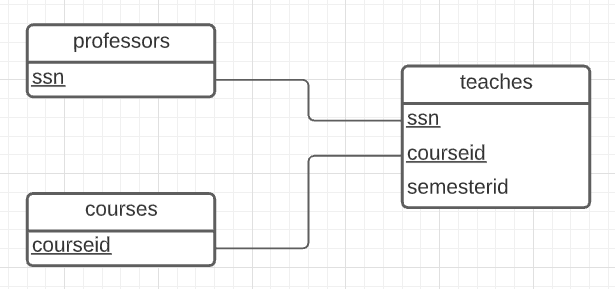
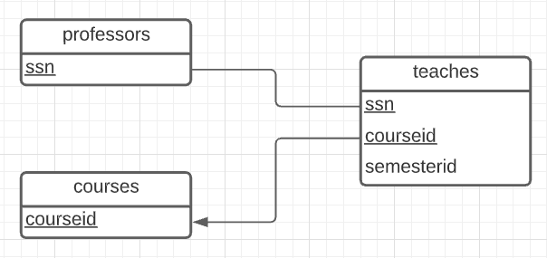
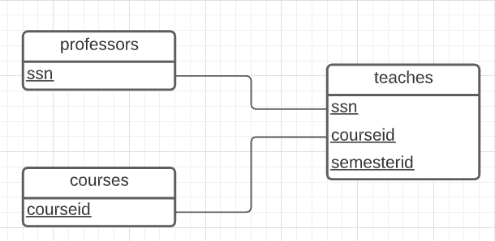
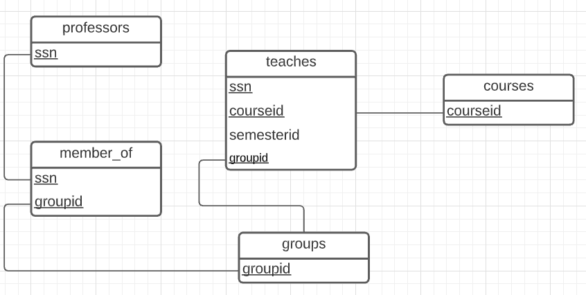

## Réponses obtenues pour les diagrammes de relation

À partir des diagrammes ER, voici les diagrammes relationnels pour les systèmes.

Q1.



Q3.



Q5.



Q6.



## Schémas relationnels

Avec les diagrammes relationnels ci-dessus, voici les schémas SQL relationnels pour les systèmes.

Voici le sql utilisé pour représenter le diagramme de Q1.

```sql
CREATE TABLE professors(
  ssn VARCHAR(50),
  PRIMARY KEY(ssn)
);

CREATE TABLE courses(
  courseid VARCHAR(50),
  PRIMARY KEY(courseid)
);

CREATE TABLE teaches(
  ssn VARCHAR(50),
  courseid VARCHAR(50),
  semesterid VARCHAR(10),
  PRIMARY KEY(ssn, courseid)
);
```

Voici celui pour Q3. Similaire à celui de la question 1.

```sql
CREATE TABLE professors(
  ssn VARCHAR(50),
  PRIMARY KEY(ssn)
);

CREATE TABLE courses(
  courseid VARCHAR(50),
  PRIMARY KEY(courseid)
);

CREATE TABLE teaches(
  ssn VARCHAR(50),
  courseid VARCHAR(50),
  semesterid VARCHAR(10),
  PRIMARY KEY(ssn, courseid)
);
```

Celui pour Q5

```sql
CREATE TABLE professors(
  ssn VARCHAR(50),
  PRIMARY KEY(ssn)
);

CREATE TABLE courses(
  courseid VARCHAR(50),
  PRIMARY KEY(courseid)
);

CREATE TABLE teaches(
  ssn VARCHAR(50),
  courseid VARCHAR(50),
  semesterid VARCHAR(10),
  PRIMARY KEY(ssn, courseid, semesterid)
);
```

Celui pour Q6

```sql
CREATE TABLE professors(
  ssn VARCHAR(50),
  PRIMARY KEY(ssn)
);

CREATE TABLE courses(
  courseid VARCHAR(50),
  PRIMARY KEY(courseid)
);

CREATE TABLE teaches(
  ssn VARCHAR(50),
  courseid VARCHAR(50),
  semesterid VARCHAR(10),
  groupid VARCHAR(10),
  PRIMARY KEY(ssn, courseid, groupid)
);

CREATE TABLE groups(
  groupid VARCHAR(10),
  PRIMARY KEY(groupid)
);

CREATE TABLE member_of(
  ssn VARCHAR(50),
  groupid VARCHAR(10),
  PRIMARY KEY(ssn, groupid)
);
```
