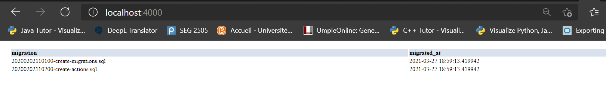
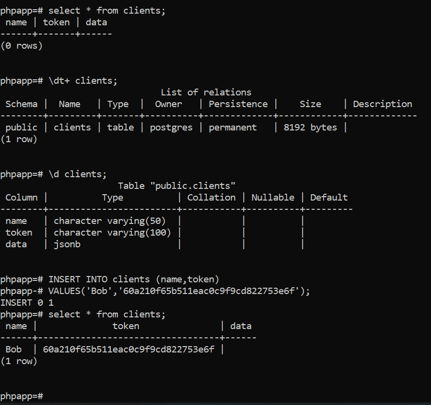
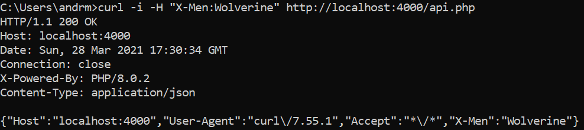
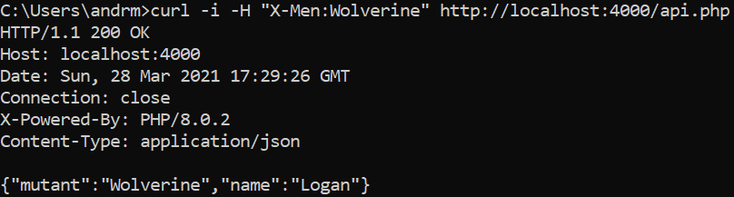

# Lab 08 CSI 2532

## Exercice 1: Configurer PHPAPP

La configuration de la base de données semble s'être faite correctement. Voici le résultat obtenu à la suite de la lecture des instructions du README.md qui venait
avec la description du labo.

## Exercice 2: Créer un client

Pour cet exercice,j'ai commenc. par créer une table pour pouvoir conserver les clients(noms,token et data) puis j'ai inséré un client appelé Bob, qui possède un token unique
mais qui ne possède cependant pas de data. Voici ainsi que l'image qui démontre la création du client.

## Exercice 3: Créer une API

Voici les résultats obtenus pour cet exercice. On peut voir que j'ai une en-tête personnalisée, d'autant plus qu'on est en mesure de voir le nom du mutant.

Et aussi:

